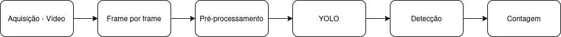
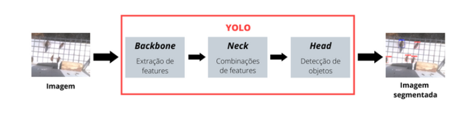
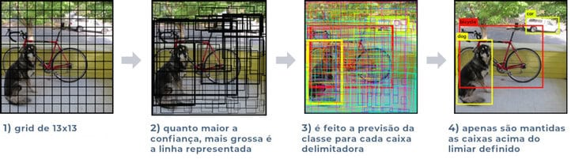
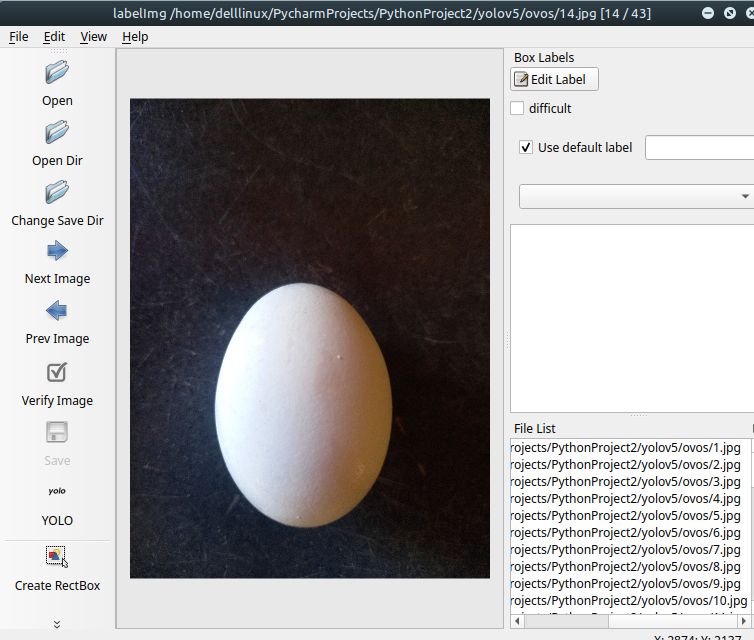
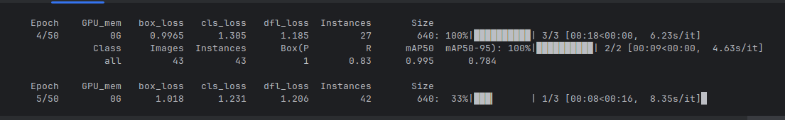
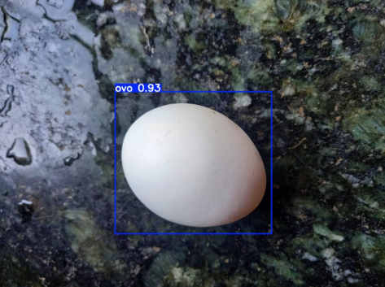

# 🥚 Projeto acadêmico de Processamento de Imagens utilizando Visão Computacional e YOLO

<p align="justify">
    Este projeto foi realizado para a disciplina de Processamento de Imagens no 9º período da graduação de Engenharia de Computação.
</p>

## 🎯 Objetivos 
<p align="justify">
    O presente projeto teve como objetivo estudar, analisar e pesquisar sobre Processamento de Imagens usando Visão Computacional, colocando em prática a execução de um projeto. O exemplo escolhido para este projeto foi a contagem de ovos na indústria avícola.
</p>

## 🧠 Processamento de imagem aplicado
<p align="justify">
    A etapa inicial do processamento de imagem é a aquisição de imagem ou vídeo, é
a etapa de conversão de uma cena real tridimensional em uma imagem digital. 
</p>

<p align="justify">
Após a aquisição de imagem o seguinte passo é o pré-processamento antes de ser
enviada para o modelo YOLO. Nesse passo a imagem é redimensionada para o padrão
exigido pelo modelo, normalização dos valores de pixels, o aumento do conjunto de dados
e a divisão dos dados em conjuntos de treino, validação e teste.
</p>

<p align="justify">
O seguinte passo é a detecção com o modelo YOLO, esse modelo atua
diretamente sobre a imagem, fazendo a segmentação e a localização dos objetos, que
identifica onde há o objeto a ser contado na imagem, nesse caso, segmenta onde há ovos
na imagem. O modelo classifica os objetos e recebe um rótulo, com uma pontuação de
confiança. Após isso ele contabiliza o objeto.
</p>

<p align="center">
  
</p>

## 👁️ Modelo YOLO

<p align="justify">
YOLO é um método de detecção de objetos de passada única (single pass) que
utiliza uma rede neural convolucional como extrator de características (features). Diferente
de algoritmos anteriores de detecção de objetos, como R-CNN ou Faster R-CNN, ele
apenas precisa olhar pela imagem uma única vez para enviar para a rede neural. Por isso
ele recebe esse nome (You Only Look Once – “Você só olha uma vez”). E devido a essa
característica, o YOLO foi capaz de conseguir uma velocidade na detecção muito maior
do que as técnicas concorrentes, sem perder em acurácia.
</p>

<p align="justify">
A arquitetura do modelo possui 3 subdivisões principais da rede: o Backbone,
responsável por extrair características (features) da imagem. A Neck, a qual trata essas
features para a etapa de detecção, agregando e combinando as mesma. E a Detect
(também chamada de Head), onde a detecção é feita de fato, que possui como saída um
vetor contendo os dados das detecções feitas (descrições das caixas delimitadoras) e,
com isso, a imagem com a localização dos objetos de interesse é formada.
</p>

<p align="center">
  
</p>

<p align="justify">
Além disso, a arquitetura do modelo YOLO possui 24 camadas convolucionais, 4
camadas de pooling máximo e duas camadas totalmente conectadas. Essa arquitetura
funciona da seguinte maneira:
</p>

<p align="justify">
Redimensionamento da imagem de entrada para 448x448 antes de passar pela
rede neural e é aplicado uma convolução de 1x1 para reduzir o número de canais, pois
diminui a complexidade e permite a aprendizagem eficiente. Em seguida de uma
convolução de 3x3 para gerar uma saída cuboidal, onde gera as características de
formas, bordas e texturas a ser identificada. Função de ativação ReLU é realizadas em todas as convoluções exceto a camada final. Algumas técnicas adicionais, como
normalização de lote e abandono, respectivamente, regularizam o modelo e evitam que
ele se ajuste demais.
</p>

<p align="center">
  
</p>

<p align="justify">
Após a detecção do objetos, tem-se por fim a contagem do objeto. A contagem
pode ser realizada de diferentes formas. Uma abordagem simples é contar todas as
detecções em cada frame. No entanto, isso pode gerar contagens duplicadas se um
mesmo ovo for detectado em vários frames. Para evitar que isso ocorra, é possível utilizar
técnicas como Linhagem Virtual na qual consiste em uma linha imaginária é colocada na
imagem. Quando um objeto cruza essa linha em uma direção, o contador é incrementado.
</p>

## 🛠️ Projeto

<p align="justify">
O primeiro passo foi tirar fotos de ovos em
diferentes fundos e iluminação. Após isso foi organizado em uma pasta chamada ovos.
Com uma ferramenta chamada LabelImg, a pasta ovos foi aberta pelo open dir. 
</p>

<p align="center">
  
</p>

<p align="justify">
Após essa etapa, foram gerados arquivos .txt contendo as coordenadas das caixas
e um arquivo classes.txt especificando a classe dos objetos (neste caso, apenas "ovo").
Também foi criado o arquivo data.yaml, necessário para treinar o modelo, com a seguinte
estrutura:
</p>

```
train: images
val: images
nc: 1
names: ['ovo']
```

<p align="justify">
A seguinte etapa consistiu no treinamento do modelo. Usando a seguinte linha no
terminal do PyCharm: 
</p>

```
yolo detect train data=data.yaml model=yolov8n.pt epochs=50
imgsz=640 save_period=1.
```
A imagem abaixo mostra esse processo.

<p align="center">
  
</p>

<p align="justify">
A figura abaixo mostra o resultado do código, mostrando que o modelo detecta ovo,
com 93% de eficiência.
</p>

<p align="center">
  
</p>

<p align="justify">
Para a contagem em vídeo, foi implementada uma linha virtual ao centro da
imagem. Sempre que um ovo cruza essa linha, um ovo é contabilizado. O algoritmo
identifica os centros dos objetos detectados, acompanha os movimentos dos ovos ao
longo dos quadros e incrementa o contador ao cruzar a linha. Conforme o vídeo abaixo:
</p>

<p align="center">
  
</p>


## Referências

 - ALBUQUERQUE, Davi Queiroz; BRAGA, Antonio Rafael; GOMES, Danielo G.; BOMFIM, sac Gabriel Abrahão. Vista do Aplicando um modelo YOLO para detectar e diferenciar por imagem castas de abelhas melíferas de forma automatizada. Disponível em: <https://sol.sbc.org.br/index.php/wcama/article/view/20696/20523> Acesso 24 de mai. 2025.
 - DATACAMP. Explicação sobre a detecção de objetos YOLO. <https://www.datacamp.com/pt/blog/yolo-object-detection-explained> Acesso 22 de mai. 2025.
 - IA Expert Academy. Detecção de Objetos com YOLO – Uma abordagem moderna. Disponível em: <https://iaexpert.academy/2020/10/13/deteccao-de-objetos-com-yolo-uma-abordagem-moderna> Acesso 22 de mai. 2025.
 - IBM. O que é Computer Vision?. Disponível em: <https://www.ibm.com/br-pt/topics/computer-vision> Acesso 20 de mai. 2025.
 - Spring. Processamento de Imagens. Disponível em: <http://www.dpi.inpe.br/spring/portugues/tutorial/introducao_pro.html> Acesso 20 de mai. 2025.
 - ULTRALYTICS. Object Counting. Disponível em: <https://docs.ultralytics.com/pt/guides/object-counting/#can-i-use-yolo11-for-advanced-applications-like-crowd-analysis-and-traffic-managemen> Acesso 24 de mai. 2025.


    

